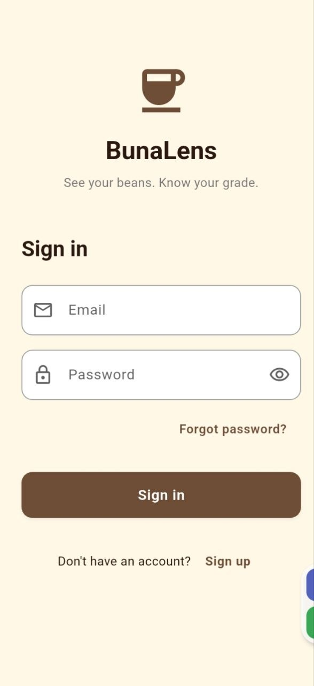
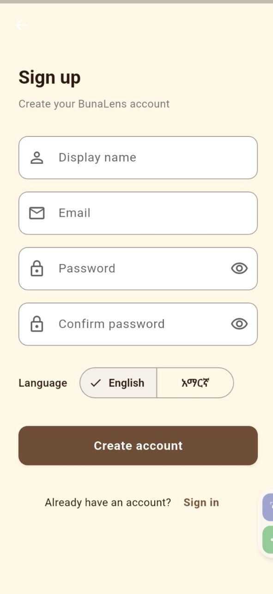
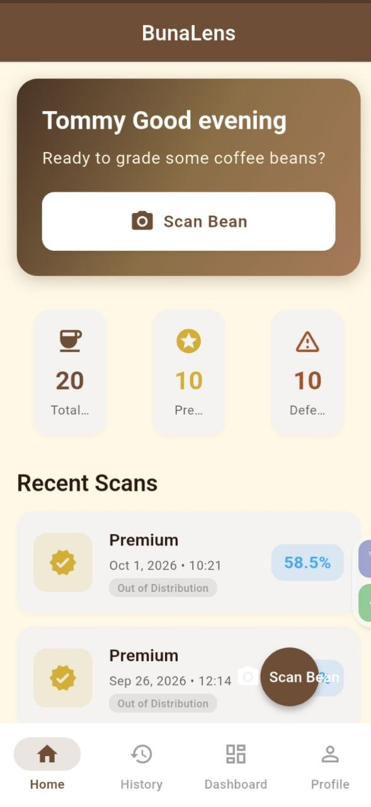
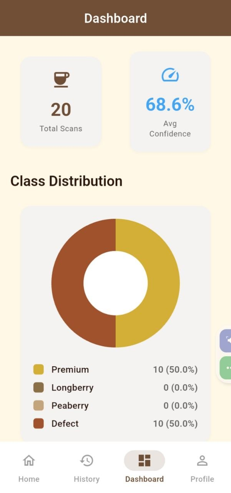
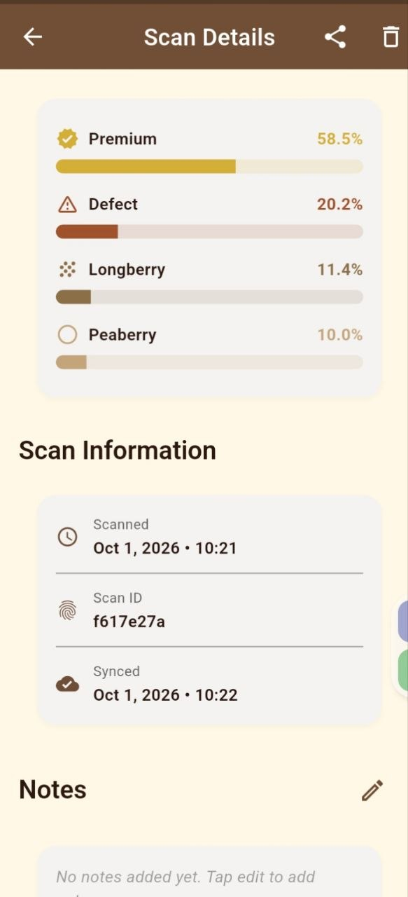
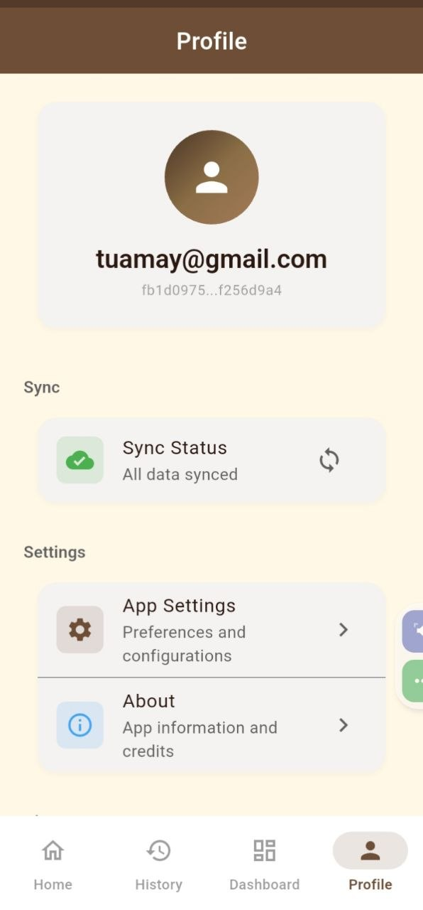

# ☕ BunaLens

> AI-powered Ethiopian coffee bean quality grading — offline-first, cloud-synced, built with Flutter.


---

## 📱 Screenshots

<div align="center">

| Sign In | Sign Up | Home |
|:---:|:---:|:---:|
|  |  |  |

| Dashboard | Scan Details | Profile |
|:---:|:---:|:---:|
|  |  |  |

</div>

---

## 🌟 Features

### Core
- **AI Grading** — On-device EfficientNet-B0 (TFLite float32) classifies beans into 4 grades with confidence scores
- **4 Coffee Classes** — Premium · Longberry · Peaberry · Defect
- **OOD Detection** — Out-of-distribution flag when confidence < 76.78 %
- **Scan from Camera or Gallery** — Full image preview with probability bars

### Cloud & Sync
- **Offline-First** — All scans saved locally via Drift (SQLite) first
- **Auto Sync** — 5-minute periodic sync + instant sync on network reconnect
- **Outbox Pattern** — Failed syncs retry with exponential backoff (5 s → 10 s → 20 s → 40 s → 80 s)
- **Server-Wins Conflict Resolution** — Clean merge strategy for multi-device use
- **Image Upload** — Bean photos uploaded to Supabase Storage before cloud insert

### Authentication
- **Email / Password Auth** — Powered by Supabase Auth
- **Secure Session Storage** — Sessions persisted via Flutter Secure Storage
- **Email Verification** — Handles both confirmed and unconfirmed sign-up flows
- **Password Reset** — Full forgot-password email flow

### UI / UX
- **Material 3** — Coffee-brown design system (#6F4E37 primary)
- **Light & Dark Mode** — System-adaptive theming
- **Bottom Navigation** — Home · History · Dashboard · Profile
- **Personalized Greeting** — "Good morning/afternoon/evening, [Name]"
- **Onboarding Carousel** — 3-slide intro shown only on first launch
- **Pull-to-Refresh** — Manual sync trigger on History screen
- **Pending Sync Badge** — Visual indicator of unsynced scans

### Dashboard & Analytics
- **Donut Pie Chart** — Class distribution (custom `CustomPainter`)
- **Quality Metrics** — Quality % vs Defect %
- **Insights** — Top class, OOD count, last scan date

---

## 🏗 Architecture

```
lib/
├── app/
│   ├── bindings/       # Dependency injection (InitialBinding)
│   ├── routes/         # GetX routes, pages, auth middleware
│   └── app.dart        # GetMaterialApp entry
│
├── core/
│   ├── config/         # AppTheme, Env (credentials)
│   ├── constants/      # AppColors design tokens
│   ├── l10n/           # Locale controller (EN / AM)
│   └── utils/          # AppLogger, ImageUtils, Validators
│
├── data/
│   ├── datasources/    # TFLite, Supabase auth/scan/storage, local storage
│   ├── local/          # Drift database schema + generated code
│   ├── models/         # AppUser, GradeResult, CoffeeClass, Prediction, ScanRecord
│   ├── repositories/   # AuthRepository, GradingRepository, HistoryRepository
│   └── services/       # ConnectivityService, SyncService (outbox engine)
│
└── modules/
    ├── auth/           # sign_in · sign_up · forgot_password
    ├── camera/         # Image picker + grading trigger
    ├── dashboard/      # Stats, pie chart, insights
    ├── history/        # List/grid, search, filter, sync
    ├── home/           # Greeting, stats cards, recent scans
    ├── onboarding/     # 3-slide first-launch carousel
    ├── profile/        # User info, sync status, sign out
    ├── result/         # Scan detail, notes editor, delete
    ├── settings/       # Theme, clear history
    └── shell/          # Bottom navigation IndexedStack
```

### Key Design Decisions

| Concern | Decision | Reason |
|---|---|---|
| State management | GetX | Lightweight, built-in DI + routing |
| Local DB | Drift (SQLite) | Type-safe queries, code generation |
| Sync pattern | Outbox queue | Guarantees delivery without real-time infra |
| Conflict resolution | Server wins | Simplest correct strategy for MVP |
| ML runtime | TFLite | On-device, no network required for inference |
| Auth storage | Flutter Secure Storage | OS keystore — not plain SharedPreferences |

---

## 🤖 ML Model

| Property | Value |
|---|---|
| Architecture | EfficientNet-B0 |
| Format | TFLite float32 |
| Input | 224 × 224 × 3 (ImageNet normalization) |
| Output | 4-class softmax probabilities |
| Classes | `defect` · `longberry` · `peaberry` · `premium` |
| OOD Threshold | 0.7678 (max probability) |
| Inference device | CPU (all Android/iOS/Windows) |

The model file lives at `assets/models/coffee_efficientnet_b0_float32.tflite`.  
Web inference is intentionally disabled — a browser-compatible model is not yet bundled.

---

## 📦 Dependencies

### Runtime

| Package | Purpose |
|---|---|
| `get` ^4.6.6 | State management, routing, DI |
| `supabase_flutter` ^2.6.0 | Cloud auth, database, storage |
| `drift` ^2.20.3 | Local SQLite ORM |
| `sqlite3_flutter_libs` ^0.5.24 | Native SQLite binaries |
| `tflite_flutter` ^0.12.1 | On-device ML inference |
| `image_picker` ^1.1.2 | Camera and gallery access |
| `image` ^4.2.0 | Image decoding and resizing |
| `connectivity_plus` ^6.0.5 | Network state monitoring |
| `flutter_secure_storage` ^9.2.2 | Encrypted session storage |
| `shared_preferences` ^2.3.2 | Onboarding flag, locale |
| `package_info_plus` ^8.0.2 | App version display |
| `uuid` ^4.5.1 | Client-side scan ID generation |
| `intl` ^0.20.2 | Date/number formatting |
| `share_plus` ^10.0.2 | Share scan results (planned) |
| `google_fonts` ^6.2.1 | Custom typography (available) |

### Dev

| Package | Purpose |
|---|---|
| `drift_dev` ^2.20.3 | Drift code generation |
| `build_runner` ^2.4.13 | Code generation runner |
| `flutter_lints` ^4.0.0 | Lint rules |

---
## 🔐 Security

- **Supabase Anon Key** is safe for client use — Row Level Security (RLS) ensures each user can only read/write their own data.
- **Service Role Key** is never used in the app.
- **Sessions** are stored in the OS keystore via Flutter Secure Storage — not in plain SharedPreferences.
- **Cleartext HTTP** is disabled in `network_security_config.xml`.

---

## 📄 License

This project is licensed under the **MIT License** — see [LICENSE](LICENSE) for details.

---


<p align="center">Built with ☕ for Ethiopian coffee quality</p>
